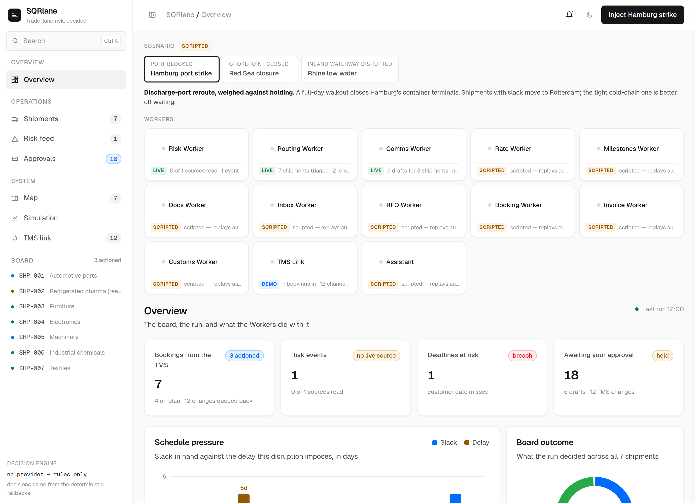

# SQRlane

**Trade-lane risk, decided.**

**SQRlane runs on the bookings in a forwarder's TMS.** It is not another book to keep:
the shipments are read out of the system of record, the Workers decide against those
records, and every action they take is written back onto them.

Three AI Workers watch global news — in several languages — for events that disrupt
shipping. When one hits, they work out which bookings are affected, decide whether to
**reroute** or **hold** each one, explain *why*, draft the carrier and customer emails a
person would otherwise have to write, and queue the change each decision implies back into
the TMS: the exception on the booking, the new discharge port, routing code and ETA, the
drafted mail on the communication log.

Risk → decision → communication → the system of record, as one closed loop, with the
reasoning recorded, and every message and every write held for human approval.

> In this build the TMS is a **demo connector** (`src/tms.py`). Both directions are modelled
> and the read is the only door to the book — nothing else in `src/` opens it — but no TMS is
> contacted: there is no client, no credential and no endpoint, and a write-back is a
> described change that stays queued.

| Worker | Does | |
|---|---|---|
| **Risk Worker** | Reads global news in several languages, tags what threatens a lane, and flags the exception on the booking | `LIVE` |
| **Routing Worker** | Weighs schedule slack against added transit and expected delay, then writes the booking change | `LIVE` |
| **Comms Worker** | Drafts the carrier and customer emails and files them against the booking. Sends nothing | `LIVE` |
| **Rate Worker** | Quote and rate lookups across the carriers on a lane | `SCRIPTED` |
| **Milestones Worker** | Milestones and position, against the TMS booking | `SCRIPTED` |
| **Docs Worker** | Field extraction from bills of lading | `SCRIPTED` |
| **Inbox Worker** | Triages inbound carrier and customer mail, and drafts the reply | `SCRIPTED` |
| **RFQ Worker** | Reads an inbound rate request and drafts the quote back | `SCRIPTED` |
| **Booking Worker** | Holds the carrier booking on the TMS record, and the amendment a decision requires | `SCRIPTED` |
| **Invoice Worker** | Reconciles the carrier invoice against the rate that was agreed | `SCRIPTED` |
| **Customs Worker** | Checks the entry for the discharge country, and escalates what needs a person | `SCRIPTED` |
| **TMS Link** | The system of record: bookings in, and every Worker's action back out | `DEMO CONNECTOR` |
| **Assistant** | Answers questions about what is on the board | `SCRIPTED` |

The first three genuinely run. The scripted ones replay authored data and say so on screen —
they react to the scenario and the selected shipment, but they are not reasoning. The TMS Link
is neither: its write-backs are derived from the decisions that run actually made, and what
makes it a demo is the far end, so it carries its own tag.

**Nothing leaves the app, and that includes the workflow layer.** A drafted reply, a drafted
quote and a change queued into the TMS all sit behind the same approval gate as the carrier and
customer emails, because they are all outbound actions. `tests/test_comms_agent_sends_nothing.py`
checks every one of them, and separately parses every file in `src/` to prove no transport
library exists to send them with.
**The tag is the honesty.**

## Four disruptions, one shipment pool

The seven shipments never change; the active risk event does. That is the point — the
same board reacting differently is what shows the system generalises rather than
performing one trick.

| Scenario | What breaks | The decision it forces |
|---|---|---|
| **Hamburg strike** | A port | Reroute the ones with slack, hold the tight cold-chain one |
| **Red Sea closure** | A chokepoint | The whole board weighs the Cape against waiting |
| **Rhine low water** | An inland waterway | A **mode switch** — barge to rail — not a port change |
| **France wildfire** | A land corridor | Ready and switchable-on; off by default |



*Captured offline — no network and no provider key — so the risk feed falls back to the scripted scenario and every decision is badged `rule`. On the deployed instance the sources are live and the model decides; the layout and the numbers are otherwise exactly what a run produces.*

> **The honest line:** the risk detection is real — it runs against live news right now.
> The shipments are synthetic, so a disruption can be shown on demand instead of waiting
> for one. **Emails are drafted and never sent.**

That distinction is on screen, not buried in a footnote: the risk feed is marked *live*,
the shipment board is marked *synthetic*, and every event says whether it came from a
real source or the scripted scenario.

---

## Run it

Needs Python 3.11+.

```bash
python -m venv .venv && source .venv/bin/activate   # Windows: .venv\Scripts\activate
pip install -r requirements.txt

cp .env.example .env        # then paste a free API key into .env
uvicorn src.app:app --reload
```

Open **http://127.0.0.1:8000** for the landing page, then **Open the demo** —
or go straight to **http://127.0.0.1:8000/app** and press **Inject Hamburg strike**.


| Route | What |
|---|---|
| `/` | Landing page — what this is, and what is real about it |
| `/app` | The dashboard. This is the demo, and the button lives here |
| `/api/health` | What a running instance can actually see. First stop when a deploy misbehaves |
| `/api/gauges` | Live Rhine water levels from PEGELONLINE. The landing page's one real number |
| `POST /run` | One cycle: refresh risk, decide, draft |

For the AI key, pick one free provider and put it in `.env`:

| Provider | Where | `.env` |
|---|---|---|
| **Groq** (recommended) | https://console.groq.com | `GROQ_API_KEY=…` (provider defaults to groq) |
| Google Gemini | https://aistudio.google.com/apikey | `LLM_PROVIDER=gemini`, `GEMINI_API_KEY=…` |
| Ollama (local, no key) | https://ollama.com | `LLM_PROVIDER=ollama` |

You do **not** set a model name. On Groq the app asks your key which models it can
actually run and picks the best available one, because Groq retires and renames
models and a hard-coded name that has been retired fails with a 404 that looks
exactly like a broken key. To see what your key offers:

```bash
python -m src.llm --models
```

Pin one with `LLM_MODEL` in `.env` only if you want a specific model — and even then,
if it turns out to be unavailable the app falls back to discovery rather than failing.

Without a key it still runs — decisions and emails come from deterministic fallbacks,
and every card that used one is badged `rule` so you can see it.

---

## What happens when you press the button

1. **Seven bookings in transit**, read out of the TMS, all green.
2. **A strike hits the Port of Hamburg.** One click.
3. **It was caught from a German-language source first** — the feed shows the original
   headline (*"Warnstreik im Hamburger Hafen…"*) next to the English one, roughly a day
   before the English wires carried it.
4. **The whole board is triaged in seconds** — two reroute, one holds, four stay green.
   It doesn't cry wolf.
5. **Each decision opens up** into plain-English reasoning, the routes it rejected and
   why, and the full recorded trail of checks behind the call.
6. **The emails are drafted** — one to the carrier, one to the customer. Nothing is sent.
7. **The changes are queued back into the TMS** — the exception on the booking, the new
   discharge port, routing code and ETA, and each draft on the communication log. Nothing is
   written. The bookings left on plan queue nothing at all.

The whole thing runs in well under two minutes.

---

## The human-approval gate

Drafts land in **Awaiting approval**, and so does every change queued into the TMS. A person
clicks **Approve** and it moves to **Approved — ready to send** (or **ready to write**).

That is the whole interaction, and it is deliberately the whole interaction. Approval is
a state change: there is no SMTP, no email library and no transport of any kind anywhere
in `src/`, no TMS client and no endpoint, and tests assert it stays that way. Say this out loud in the demo — human
oversight is the responsible design, not a missing feature.

---

## The five components

| | | |
|---|---|---|
| **TMS link** | `src/tms.py` | The system of record. Reads the book in, and turns each Worker's action into the booking change it implies — queued, never written. Imports nothing but `json`, `datetime` and the config. |
| **Risk Monitor** | `src/risk_monitor.py` | Pulls GDELT, multilingual RSS and Rhine gauges. An LLM classifies each item for logistics relevance → chokepoint, type, severity. |
| **Route Advisor** | `src/route_advisor.py` | Weighs schedule slack against added transit against expected disruption delay. Decides reroute / hold / no-action, and records the trail. |
| **Comms Agent** | `src/comms_agent.py` | Drafts a carrier email and a customer email, in two deliberately different voices. Sends nothing. |
| **Orchestrator** | `src/orchestrator.py` | The loop, plus `src/app.py` (FastAPI), `static/index.html` (the dashboard) and `static/landing.html` (the front page). |

Each Worker reports what it handled on every run — sources read, shipments triaged,
drafts written, and how many came from the model rather than the deterministic
fallback. Those numbers are counted from the run that just happened. **Nothing on the
dashboard is illustrative**, and there are no traction, accuracy or percentage claims
anywhere: real reasoning on synthetic shipments is the honest pitch.

Each runs on its own, which is how you debug one without the others:

```bash
python -m src.risk_monitor  --inject          # add --no-llm to skip the AI call
python -m src.route_advisor --inject --shipment SHP-002
python -m src.comms_agent   --inject
python -m src.orchestrator  --no-live         # the whole loop, no network
```

---

## Deploying to Vercel

The repo is configured for it: `api/index.py` re-exports the same FastAPI app,
and `vercel.json` rewrites every path to it, so `/` and `POST /run` both land on
one function.

1. In Vercel, **Add New → Project** and import this GitHub repo.
2. Framework preset **Other**. Leave build and output settings empty — `vercel.json`
   handles it.
3. Add your AI key under **Settings → Environment Variables**
   (`LLM_PROVIDER` and `GROQ_API_KEY`), then redeploy so it takes effect.

**Check `/api/health` first.** It reports what the running app can actually see —
the path it received, whether the dashboard and data files shipped, and whether a
provider is configured. If something is wrong, it will say so there before you go
hunting.

Serverless changes two things, both handled automatically:

- **The filesystem is read-only.** `risk_state.json` is written to the temp
  directory instead. Nothing is kept between requests, which is fine — this app
  has no database and never did.
- **Functions have a hard timeout.** `maxDuration` is 60s, and on a deployed host
  the live pull is trimmed to 10s and the classifier to 16 items to leave room for
  the LLM calls. Tune with `LIVE_PULL_BUDGET_SECONDS` and `MAX_ITEMS_TO_CLASSIFY`
  if a run gets cut off.

> **A demo you are presenting should run locally.** A full cycle makes up to a
> dozen sequential model calls, and on a cold serverless function that can bump the
> 60-second ceiling. Locally there is no ceiling and no cold start. Deploy for
> sharing a link; run `uvicorn` for the room.

---

## Built to survive a live audience

- **A dead source is skipped, not fatal.** Each one is read in its own function and its
  failure is recorded and shown.
- **A slow source cannot stall the demo.** The whole live pull has a hard 25-second
  budget; whatever isn't read by then is skipped and the cycle moves on.
- **No provider, no problem.** Decisions and drafts fall back to deterministic logic,
  clearly badged.
- **The page is self-contained.** No CDN, no external font, no request beyond its own
  API — flaky wifi can't blank it.
- **A failed run shows a sentence, not a stack trace.**

---

## Before you present it

The demo runs itself; these are the things only a person can check.

1. **Open the risk feed and read the source line** — "N of 14 sources read". If N is
   0 or 1, the live news pull is not working and the `LIVE` chip is overclaiming.
   `python -m src.risk_monitor` says which sources failed and why.
2. **Open all three actioned cards**, not just one. SHP-001 and SHP-005 reroute;
   SHP-002 holds. They take different branches and read differently.
3. **Check the decision-engine strip** at the top of the board — it names the model
   actually running and how many decisions and drafts came from it rather than the
   rules. A `rule` or `template` badge on a card means the model did not do that one,
   and the reason prints underneath.
4. **Read SHP-002's customer email aloud.** It is the centrepiece: no good option,
   here is the least-bad one. If you would not send it as written, the prompts in
   `comms_agent.py` are what to change.
5. **Run it from `uvicorn` locally**, not the deployed link. A cold serverless
   function plus about fourteen model calls sits close to the 60-second ceiling.

---

## What this is not

No real route optimisation (routes are pre-authored candidates the agent *chooses among*
and justifies). No sending. **No live TMS connection** — working through the TMS is the
design and both directions are modelled, but the far end is absent: no vendor, no
credential, no endpoint, and nothing is ever written. No scheduler. No database. No paid
data. The "AI Worker" framing on the header is cosmetic.

It is a learning artifact and a demo — not a live product. The gap between this and a
business is the integration, trust and liability wall, which is real work for later.

---

## Tests

```bash
python -m unittest discover -s tests
```

No test framework to install — `unittest` from the standard library, plus the
`requests` the app already depends on. Five files, each holding up a claim the demo makes
out loud. A claim nobody checks is a claim that has already stopped being true.

`tests/test_comms_agent_sends_nothing.py` — **the Comms Agent drafts emails and never
sends them.** It parses every file in `src/` and fails, naming the file and line, if a
transport library is ever imported — including through `__import__` or `importlib`. Then
it runs a full offline cycle and checks that every draft it produced carries
`DRAFT - not sent` and starts behind the approval gate.

`tests/test_tms_is_the_system_of_record.py` — **the Workers work through the TMS.** It
fails if anything except the connector opens the shipments file, so there stays exactly
one door to the book. Then it runs a cycle and checks that all three live Workers wrote
something back, that every actioned booking has a write-back and every on-plan booking has
none, and that every one of them is `QUEUED - not written` behind the approval gate.

`tests/test_the_pages_keep_their_promises.py` — **the pages say what they should and
nothing they should not.** No language is named on the landing page or the dashboard (the
edge is source proximity, and the whitepaper is the stated exception because it names
where models come from); no period-over-period delta appears anywhere, because there is no
history to compute one from; no reference product's Worker name appears, in copy or in a
comment; and nothing loads or fetches from another host.

`tests/test_the_simulation_holds_together.py` — **the authored week makes sense as a
week.** No booking is ever offered the route it just left, yesterday's reroute is still in
place this morning, and a held booking pays a day for every day it waits.

`tests/test_a_slow_source_cannot_stall_the_demo.py` — **a slow feed cannot hang a
demo.** Against real sockets: a source that hangs and a source that trickles one byte at a
time are both cut off, and a run whose every source trickles still ends inside its budget
with the scenario intact.

It is deliberately *not* a "no networking" rule. The app makes real HTTP calls on purpose
— GDELT, PEGELONLINE, six RSS feeds and the LLM provider — and the live news pull is the
credibility anchor. What must not exist is a way to send a *message*. So `requests` is
fine and `smtplib` is not.

## Where things are

```
data/     the screenplay - chokepoints, routes, 7 bookings, four scenarios
src/      the five components + llm.py (the only door to the AI provider) + config.py
          tms.py is the only door to the book of bookings
static/   landing.html - the front page  ·  index.html - the dashboard
          fonts/ - Geist Sans + Mono, self-hosted (no CDN, ever)
tests/    the guards: nothing is ever sent, and every action goes through the TMS
*.md      the planning docs; CLAUDE.md is the working summary
```

`.env` and `risk_state.json` are gitignored. **Never commit `.env`.**
